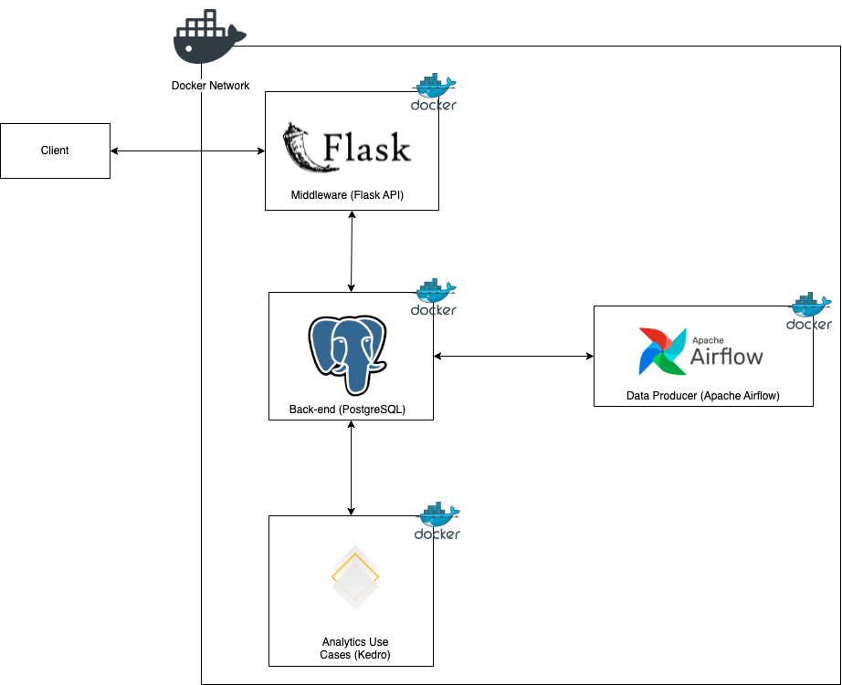

## Quant Portfolio Optimization Project

This project's goal is to provide an end-to-end solution for the portfolio optimization problem.
It currently implements the `Black-Litterman (BL)` framework for optimizing weights of an assets' 
portfolio.

External users can interact with the service through  an API and everything happens behind the
scenes.

Below there's a high level architecture to briefly describe how the tools interact to build the service.

### Technologies used
- Python
- SQL (data extraction)
- Shell script (setup automation)
- Apache Airflow (ETL / data orchestration)
- Flask (web framework for API)
- Kedro (MLOps framework and modeling)
- PostgreSQL (SQL data storage)
- Docker

### How to use the service

The python file at the root directory named `api_usage_example.py` provides all the relevant
information to interact with the service. At a high level:
1. call `available_tickers` endpoint to verify the available tickers to compound the portfolio
2. call `portfolio_optimize` endpoint to start the optimization process
3. call `optimization_results` endpoint to verify the result of the optimization

### Project's setup

The 2 must-have tools to run this project are `docker` and `docker-compose`. If you need
help installing it, there's a setup script at `setup/installations.sh` which will install all
the tools needed for dev cycle.

Once having the 2 mentioned tools, navigate to the project's root and run:
`docker-compose up airflow-init && docker-compose up`. It's going to start the `Airflow` service
along with all the other services.

### Major next steps to be implemented
- add `unit tests`
- add `pre-commit`
- add `CI pipeline` through `Azure pipeline`
- add Machine Learning model to forecast company's growth and growth confidence
  - crucial step for the `BL` investor's view stage
- acquire data to support model's creation
- add integration with `MLFlow` for model's performance tracking
- add crontab to run `Kedro` optimization from time to time

### Backlog to be implemented
- add `Apache Kafka` for asynchronous API calls
- add `Pandera` as schema validator
- add `Kubernetes` to trigger Kedro execution at every API request