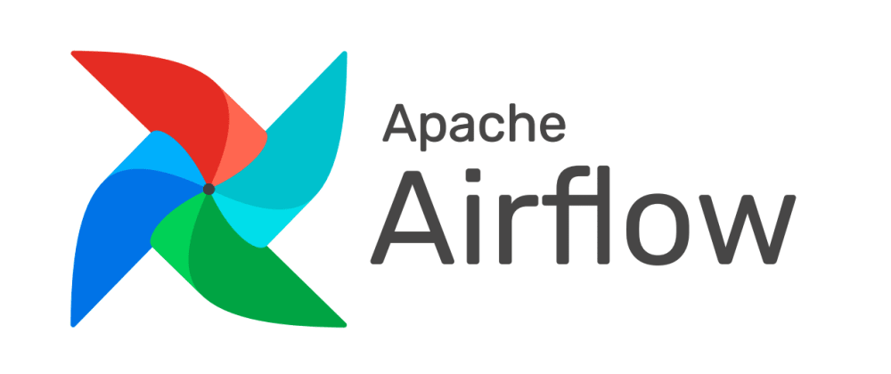

## Quant Portfolio Optimization ETL

`Airflow` is acting as the data orchestrator and producer
for the entire project. It's the entrypoint for all data
acquisition processes.

The data acquisition process is divided by data domains. In
this particular use case, data domains are driven by the
data source.

The ETL inside each data domain is divided in 3
parts:

1. `Raw`
    - Data acquisition from upstream sources and dumped as is
    - No change at all is made in the data
    - **Consumes from upstream sources and dumps into PostgreSQL**

2. `Intermediate`
    - Filters only data dumped successfully
    - Appends data into one single table when applicable
    - **Consumes from `Raw` layer and dumps into PostgreSQL**
   

3. `Primary`
    - Parsing operations such as column renaming
    - Data standardization to be consumed by other services
    - Consumes from `Intermediate` layer and dumps into PostgreSQL to be consumed by other services such as `Kedro`